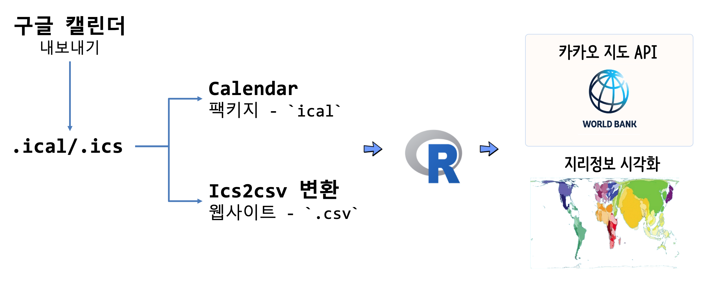

```{r setup, include=FALSE}
knitr::opts_chunk$set(echo = TRUE, message=FALSE, warning=FALSE,
                      comment="", digits = 3, tidy = FALSE, prompt = FALSE, fig.align = 'center')

# 0. 환경설정 -----
library(tidyverse)
library(rvest)
library(httr)
```

# 구글 일정 (`.ical`) &rarr; 지리정보 {#google-calendar}

[iCalendar.org](https://icalendar.org/)를 통해서 일정관련된 자료형이 표준화 작업이 진행되었고, 구글 일정도 표준을 따르고 있는 것으로 보인다. 이를 바탕으로 구글 일정에 저장된 정보를 추출하여 지도 위에 시각화하는 앱을 개발해보자.



## 구글 일정 다운로드(`.ical`) {#google-calendar-ical}

핸드폰에 저장된 구글 캘린더(Calendar) 일정을 PC로 로그인하여 우선 `.ics` 파일로 다운로드 받는다.


1. 구글 달력 [https://calendar.google.com/calendar](https://calendar.google.com/calendar) 웹사이트로 접속한다.
1. 우측상단 기어 아이콘을 클릭한 후 **설정**으로 들어간다.
1. 좌측메뉴 **가져오기/내보내기** 를 클릭한다.
1. `내보내기` 버튼을 클릭하여 로컬 컴퓨터에 다운로드 받는다.
    - `계정명@gmail.com.ical.zip` 파일 압축을 푼다.

## CSV 작업흐름 {#google-calendar-ical-csv}

### 일정 파일(`.ical`) &rarr; CSV {#google-calendar-ical-csv}

`.ical` 파일을 먼저 `.csv` 파일로 변경시켜야 엑셀에서 불러읽을 수가 있다.
이유는 엑셀에서 `.ical` 파일을 불러 읽을 수 있는 기능을 제공하고 있지 않기 때문이다.
이제, 엑셀에서 불러올 수 있는 형태 파일로 변경시킨다.

`.ical` 파일을 `.csv` 파일로 변경시키는 변환기는 GitHub과 구글링을 하게 되면 쉽게 찾을 수 있다. [https://www.indigoblue.eu/ics2csv/](https://www.indigoblue.eu/ics2csv/) 웹사이트에서 `.ics` 파일을 `.csv` 파일로 변환시킨다.

### CSV &rarr; 엑셀 [^excel-utf-8] [^excel-clean] {#google-calendar-ical-csv-excel}

[^excel-utf-8]: [Curycu, UTF-8 인코딩 CSV 파일 엑셀에서 읽는 방법](http://blog.naver.com/PostView.nhn?blogId=hancury&logNo=220191465384)

[^excel-clean]: [MS 엑셀(Excel)에서 UTF-8 로 된 csv 파일 가져오기](https://www.lesstif.com/pages/viewpage.action?pageId=54952504)

한글판 엑셀의 기본 인코딩이 UTF-8이 아니라 바로 읽을 경우 깨져서 읽을 수가 없다.

한글 윈도우가 설치된 환경에서 `utf-8`으로 인코딩된 `.csv` 파일을 불러 읽어 오는 것도 나름 기본 지식이 필요하다. CSV 파일을 엑셀로 변환시키기 위해서는 UTF-8 인코딩된 것을 엑셀에서 읽을 수 있는 인코딩으로 맞춰 불러들여야 한다.

1. 엑셀을 실행하고 빈 엑셀파일을 하나 생성시킨다.
1. 상단 메뉴에서 `데이타` &rarr; `텍스트` 를 선택합니다.
1. 가져올 파일을 선택하고 확인을 클릭합니다.
1. 콤보 박스에서 적절한 코드 타입이 선택됐는지 확인합니다.
    - UTF-8 의 코드 페이지 넘버는 65001 입니다.

## `ical` 팩키지 {#ical-pkg}

`ical` 팩키지는 [`ical`](https://atfutures.github.io/calendar/) 웹사이트에서 [iCalendar.org](https://icalendar.org/) 표준을 따르는 `ical` 파일을 R로 불러와서 다양한 분석작업을 수행하는 것을 가능하게 한다.

```{r ical-pkg, eval=TRUE}
source("~/.Renviron")

# devtools::install_github("ATFutures/ical")
library(calendar)
library(tidyverse)

ds_dat <- ic_read("data/data_scientist@gmail.com.ics")

ds_df <- ds_dat %>% 
  select(SUMMARY,DTSTART, DTEND, LOCATION, DESCRIPTION) %>% 
  filter(str_length(LOCATION) > 20) %>% 
  filter(DTSTART >= lubridate::ymd("2019-04-01")) %>% 
  top_n(5)

DT::datatable(ds_df)
```


# 구글 일정 장소 &rarr; 지도API  {#google-calendar-api}

구글 일정에서 장소정보를 뽑았다면, 다음으로 카카오 API를 사용해서 위경도 정보를 추출한다. 이를 `leaflet`에 올려 놓게 되면 원하는 일정에 방문했던 장소를 표시할 수 있게 된다.

## 위경도 반환 함수  {#google-calendar-api-df}

주소 문자열을 입력받아 위경도 데이터프레임을 반환시키는 함수를 작성한다.

```{r address-to-df}
library(httr)
library(tidyverse)
library(jsonlite)

## 주소 문자열을 받아 위경도 데이터프레임 반환

get_lonlat <- function(addr) {

  # HTTP 요청을 실행합니다. 
  addr_res <- GET(url = 'https://dapi.kakao.com/v2/local/search/address.json',
             query = list(query = addr),
             add_headers(Authorization = paste0("KakaoAK ", KAKAO_API_KEY)))
  
  # KPMG 지리정보 데이터프레임
  addr_list <- addr_res %>% 
    content(as = 'text') %>% 
    fromJSON()
  
  ## 도로명주소
  addr_df <- addr_list$documents$road_address %>% 
    select(address_name, building_name, x,y)
  
  return(addr_df)
}

get_lonlat('서울특별시 강남구 역삼동 737' )
```


## 주소 문자열 &rarr; 위경도 DF  {#google-calendar-api-df}

주소 문자열을 입력받아 위경도 데이터프레임을 반환시키는 함수를 작성한다.
다음카카오 지도 API에 위경도를 전달할 때 주소정보를 일부 정제하여 전달시켜야 한다. 이를 위해서 주소 정보를 정제한 `loc` 변수를 생성시키고 나서 다음카카오 API에 전달시켜 위경도를 받아내고 이를 깔끔하게 정제시킨다. 

```{r address-to-df-with}
## 주소정보 전처리
ds_df <- ds_df %>% 
  mutate(LOCATION = str_remove(LOCATION, "한국과학기술회관")) %>% 
  mutate(loc = str_extract(LOCATION, "[대한민국|서울].+")) %>% 
  select(-LOCATION)

## 위경도 정보 받아오기
lonlat_lst <- list()

for(i in 1:nrow(ds_df)) {
  lonlat_lst[[i]] <- get_lonlat(as.character(ds_df$loc[i]))  
}

## 시각화를 위한 데이터프레임 정리
ds_lonlat_df <- map_df(lonlat_lst, rbind) %>% 
  bind_cols(ds_df)

ds_lonlat_df %>% 
  DT::datatable()
```


# 지리정보 시각화  {#google-calendar-api-df-viz}

다음으로 `leafelt` 팩키지를 동원해서 나름 인터랙티브 시각화를 한다.

```{r address-to-df-viz}
library(leaflet)

ds_lonlat_df %>%
  mutate(x=as.numeric(x),
         y=as.numeric(y)) %>% 
leaflet() %>%
  addTiles() %>% 
  addProviderTiles(providers$OpenStreetMap) %>% 
  addMarkers(lng=~x, lat=~y, clusterOptions = markerClusterOptions(),
                   popup = ~ as.character(paste0("<strong>", paste0("행사명: ", `SUMMARY`), "</strong><br>",
                                                 "-----------------------------------------------------------<br>",
                                                 "&middot; 일시: ", DTSTART, "<br>",
                                                 "&middot; 주소: ", address_name, "<br>",
                                                 "&middot; 행사요약: ", SUMMARY, "<br>")))
```
