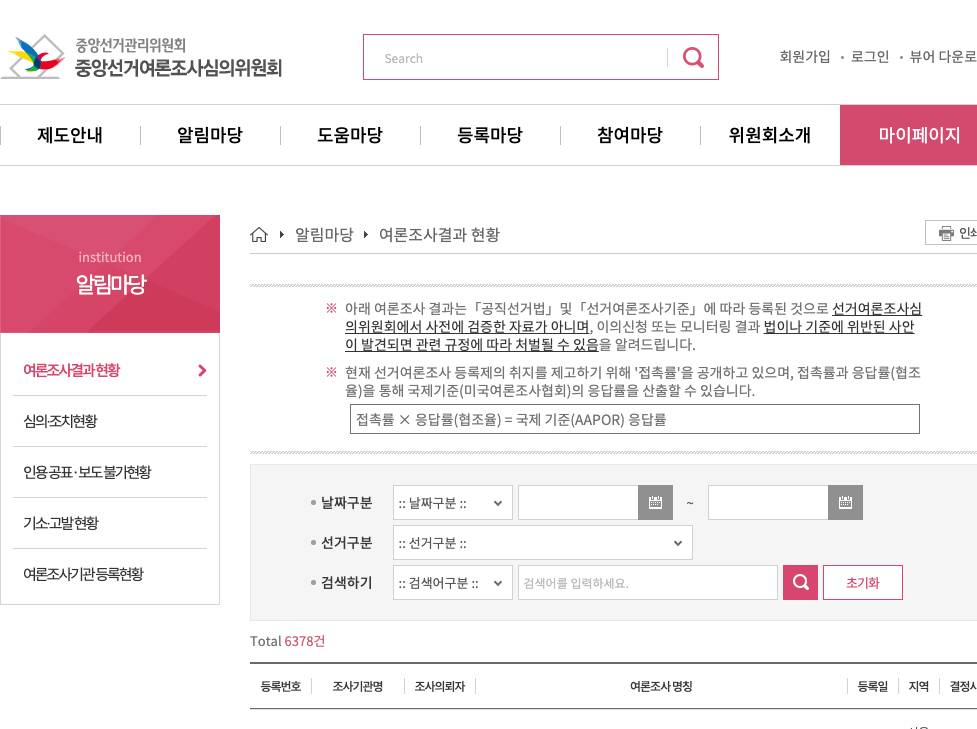

```{r setup, include=FALSE}
knitr::opts_chunk$set(echo = TRUE, message=FALSE, warning=FALSE,
                      comment="", digits = 3, tidy = FALSE, prompt = FALSE, fig.align = 'center')

```

# 제21대 총선 선거구 {#election-polls-area}

[2020년 21대 국회의원 총선거 지도](https://github.com/OhmyNews/2020_21_elec_map)는 VW Lab 김승범 소장님 [대한민국 행정동 경계 파일](https://github.com/vuski/admdongkor)을 기반으로 하여 오마이뉴스에서 제작한 지도입니다.

```{r polls-get-data-map, eval = TRUE}
library(tidyverse)
library(sf)

precinct <- st_read("data/shapefile/2020_21_elec_253_simple.json")

precinct %>% 
  filter(str_detect(SGG_1, "경기")) %>% 
  select(geometry) %>% 
  plot()
```

# 여론조사 데이터 {#election-polls}

[나무위키 제21대 국회의원선거 여론조사](https://namu.wiki/w/제21대 국회의원 선거/여론조사) 웹사이트에서 여론조사 결과를 가져온다.

```{r polls-get-data, eval = TRUE}
# 0. 환경설정 -----
library(tidyverse)
library(rvest)
library(httr)

polls_html <- read_html("https://namu.wiki/w/제21대 국회의원 선거/여론조사")
```

## 여론조사 1개 변환 {#election-polls-one}

특정 여론조사업체 한 곳("아이소프트뱅크")을 대상으로 여론조사 지지율을 변환시킨다.

```{r polls-get-data-one, eval = FALSE}
## 여론조사업체만 추출함
polls_wiki <- polls_html %>% 
  html_nodes('.wiki-table')

# polling_company <- "입소스|한국사회여론연구소|리얼미터|조원씨앤아이|한국리서치|알앤써치|한길리서치센타|글로벌리서치|아이소프트뱅크"

polling_company <- "아이소프트뱅크"

polling_lgl <- polls_html %>% 
  html_nodes(".wiki-table") %>% 
  str_detect(polling_company)

polls_tbl <- polls_wiki[polling_lgl] 

polls_lst <- map(polls_tbl, html_table, fill=TRUE)

### 데이터 정규화
#### 여론조사일
date <- polls_lst[[1]] %>% 
  select(X1) %>% 
  pull() %>% 
  str_extract("[0-9]{4}년\\s*[0-9]{1,2}월\\s*[0-9]{1,2}~?.*일") %>% 
  na.omit(.)

#### 조사기관
company <- polls_lst[[1]] %>% 
  select(X1) %>% 
  pull() %>% 
  str_extract(polling_company) %>% 
  na.omit(.)

#### 여론지지율
정당 <- polls_lst[[1]] %>% slice(2) %>% t()
후보 <- polls_lst[[1]] %>% slice(3)  %>% t()
지지율 <- polls_lst[[1]] %>% slice(4)  %>% t()

survey_tbl <- data.frame(정당 = 정당,
                       후보 = 후보,
                       지지율 = 지지율)

tibble(조사일 = date, 조사기관=company, 조사결과=survey_tbl)

```

## 여론조사 변환 함수 {#election-polls-function}

이를 함수화하여 여론조사 결과를 데이터프레임으로 변환시키는 작업을 수행한다.

```{r polls-get-data-function, eval = FALSE}

convert_df <- function(i) {
  #### 여론조사일
  date <- polls_lst[[i]] %>% 
    select(X1) %>% 
    pull() %>% 
    str_extract("[0-9]{4}년\\s*[0-9]{1,2}월\\s*[0-9]{1,2}~?.*일") %>% 
    na.omit(.)

  #### 조사기관
  company <- polls_lst[[i]] %>% 
    select(X1) %>% 
    pull() %>% 
    str_extract(polling_company) %>% 
    na.omit(.)
  
  #### 여론지지율
  정당 <- polls_lst[[i]] %>% slice(2) %>% t()
  후보 <- polls_lst[[i]] %>% slice(3)  %>% t()
  지지율 <- polls_lst[[i]] %>% slice(4)  %>% t()
  
  survey_tbl <- data.frame(정당 = 정당,
                         후보 = 후보,
                         지지율 = 지지율)
  
  return(tibble(조사일 = date, 조사기관=company, 조사결과=survey_tbl))
}

convert_df(2)
```


## 여론조사 변환 반복 {#election-polls-loop}

마지막으로 모든 여론조사결과를 데이터프레임으로 변환시키는 작업을 수행한다.

```{r polls-get-data-loop, eval = FALSE}
wanna_lst <- map(1:length(polls_lst), convert_df)

wanna_lst %>% 
  listviewer::jsonedit()

```

# 새방식 {#election-polls-new}

## 여론조사 1개 변환 {#election-polls-one}


```{r polls-get-data-html}
Sys.setlocale("LC_ALL", "C")

polls_dat <- polls_html %>% 
  html_nodes('table') %>% 
  .[55] %>% 
  html_table(fill=TRUE) %>% 
  .[[1]]

Sys.setlocale("LC_ALL", "Korean")

polls_dat
```


# 여론조사 현황 {#election-polls-news}

중앙선거여론조사심의위원회 웹사이트에서 
[알림마당 &rarr; 여론조사결과 현황](https://www.nesdc.go.kr/portal/bbs/B0000005/list.do?menuNo=200467)을 통해 여론조사진행에 대한 전반적인 사항을 확인할 수 있다. [MBC 총선여론조사](http://poll-mbc.co.kr/)웹사이트에서 동일한 데이터를 크롤링하여 데이터를 제공하고 있다.

[알림마당 &rarr; 여론조사결과 현황](https://www.nesdc.go.kr/portal/bbs/B0000005/list.do?menuNo=200467)에 담긴 여론조사결과 현황을 긁어와서 분석한다.

```{r get-data-screen-shot}
library(webshot2)

webshot("https://www.nesdc.go.kr/portal/bbs/B0000005/list.do?menuNo=200467", "fig/nesdc.png")
```



## 특정 페이지 {#election-polls-news-one}

[알림마당 &rarr; 여론조사결과 현황](https://www.nesdc.go.kr/portal/bbs/B0000005/list.do?menuNo=200467)의 첫번째 현황만 가져와서 데이터프레임으로 변환시킨다.

```{r get-data-one-page}
library(tidyverse)
library(rvest)

nesdc_html <- read_html("https://www.nesdc.go.kr/portal/bbs/B0000005/list.do?menuNo=200467")

nesdc_txt <- nesdc_html %>% 
  html_nodes('div.board') %>% 
  html_nodes('span.col') %>% 
  html_text()

nesdc_dat <- nesdc_txt %>% 
  enframe() %>% 
  mutate(variable = rep(1:7, 11)) %>% 
  mutate(observation = rep(1:11, each=7)) %>% 
  select(-name) %>% 
  spread(variable, value)

nesdc_df <- nesdc_dat %>% 
  set_names(nesdc_dat[1,]) %>% 
  slice(2:n()) %>% 
  select(-`1`, -결정사항)

nesdc_df %>% 
  DT::datatable()
```


## 두번째 페이지 {#election-polls-news-all}


`https://www.nesdc.go.kr/portal/bbs/B0000005/list.do?menuNo=200467&pageIndex=2"` 와 같이 `&pageIndex=2`만 조정하게 되면 다른 페이지를 가져올 수 있는 것이 확인되었다.

```{r get-data-two}

nesdc_html <- read_html("https://www.nesdc.go.kr/portal/bbs/B0000005/list.do?menuNo=200467&pageIndex=2")

nesdc_txt <- nesdc_html %>% 
  html_nodes('div.board') %>% 
  html_nodes('span.col') %>% 
  html_text()

nesdc_dat <- nesdc_txt %>% 
  enframe() %>% 
  mutate(variable = rep(1:7, 11)) %>% 
  mutate(observation = rep(1:11, each=7)) %>% 
  select(-name) %>% 
  spread(variable, value)

nesdc_df <- nesdc_dat %>% 
  set_names(nesdc_dat[1,]) %>% 
  slice(2:n()) %>% 
  select(-`1`, -결정사항)

nesdc_df
```

## 함수 {#election-polls-news-all-function}

`https://www.nesdc.go.kr/portal/bbs/B0000005/list.do?menuNo=200467&pageIndex=2"` 와 같이 `&pageIndex=2`만 조정하게 되면 다른 페이지를 가져올 수 있는 것이 확인되었기 때문에 함수를 만들어서 이를 테스트 한다.

```{r get-data-two}

get_survey_page <- function(page) {
  
  nesdc_url <- glue::glue("https://www.nesdc.go.kr/portal/bbs/B0000005/list.do?menuNo=200467&pageIndex={page}")
  
  nesdc_html <- read_html(nesdc_url)
  
  nesdc_txt <- nesdc_html %>% 
    html_nodes('div.board') %>% 
    html_nodes('span.col') %>% 
    html_text()
  
  nesdc_dat <- nesdc_txt %>% 
    enframe() %>% 
    mutate(variable = rep(1:7, 11)) %>% 
    mutate(observation = rep(1:11, each=7)) %>% 
    select(-name) %>% 
    spread(variable, value)
  
  nesdc_df <- nesdc_dat %>% 
    set_names(nesdc_dat[1,]) %>% 
    slice(2:n()) %>% 
    select(-`1`, -결정사항)
  
  return(nesdc_df)
}

get_survey_page(3)
```


## 전체데이터 {#election-polls-news-all-crawl}

`https://www.nesdc.go.kr/portal/bbs/B0000005/list.do?menuNo=200467&pageIndex=2"` 와 같이 `&pageIndex=2`만 조정하게 되면 다른 페이지를 가져올 수 있는 것이 확인되었기 때문에 함수를 만들어서 이를 테스트했고, 이제 원하는 만큼 데이터를 페이지수를 조정해서 가져올 수 있다.

```{r get-data-fulldata, eval = FALSE}
page_index <- 1:50

nesdc_full_df <-  map_df(page_index, get_survey_page)

nesdc_full_df %>% 
  write_rds("data/nesdc_full_df.rds")

nesdc_full_df %>% 
  write_rds("data/nesdc_full_df.csv")
```

최근 500건의 데이터를 긁어와서 이를 분석하는데 `2020-01-01` 부터 분석이 되도록 데이터를 정리한다.

```{r get-data-fulldata-eval, eval = TRUE}
# nesdc_full_df <- read_rds("data/nesdc_full_df.rds")
nesdc_full_df <- read_csv("data/nesdc_full_df.csv")

nesdc_eda_df <- nesdc_full_df %>% 
  mutate(등록일 = lubridate::ymd(등록일)) %>% 
  filter(등록일 >= as.Date("2020-01-01")) %>% 
  mutate_if(is.character, factor)
```


# 탐색적 데이터 분석 {#election-polls-EDA}

본격적인 탐색적 분석에 앞서 데이터 특성을 알아본다.
이를 위해서 `skimr` 팩키지 `skim()` 함수를 사용한다.

```{r election-polls-EDA-skim}
nesdc_eda_df %>% 
  skimr::skim(.)
```


## 단변량 분석 {#election-polls-EDA-univariate}

각 변수별로 특성을 살펴본다. 

```{r election-polls-EDA-univariate}
library(summarytools)
dfSummary(nesdc_eda_df, style = 'grid', graph.magnif = 0.75, 
          valid.col = FALSE, tmp.img.dir = "/tmp")
```

