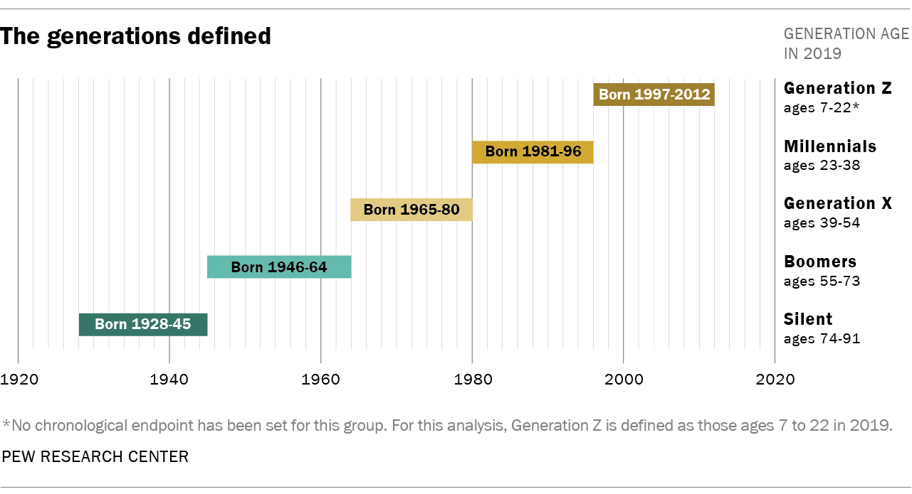
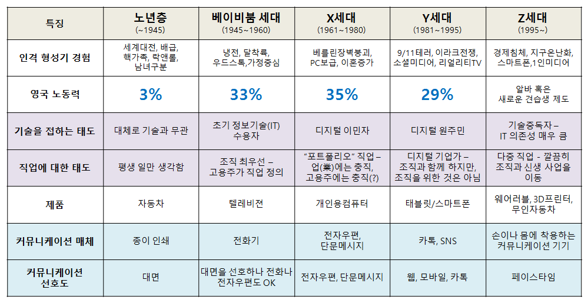

```{r setup, include=FALSE}
knitr::opts_chunk$set(echo = FALSE, message=FALSE, warning=FALSE,
                      comment="", digits = 3, tidy = FALSE, prompt = FALSE, fig.align = 'center')


```

# 미국 세대별 세분화 [^pew-generation] {#pew-media}

[^pew-generation]: [Pew Research Center, "Generations and Age"](http://www.pewresearch.org/topics/generations-and-age/)

미국 연구기관 퓨리서치센터는 다음과 같이 세대를 최근 구분했다.



- 사일런트 세대 (~1945년생) 
- 베이비붐 세대 (1946~1964년생)
- X세대 (1965~1980년생)
- 밀레니얼 세대 (1981~1996년생)
- Z세대 (1997년생~) 세대

# 영국 세대별 세분화 {#england-media}

영국을 크게 6개 세대로 세분화하고 각 세대별 특징을 다음과 같이 정의함. [^media-england]




# 대한민국 세대 분류 [^hankyung-generation] {#england-media-voters}

[^hankyung-generation]: [한국경제 (2018.10.04), "X세대…Z세대…복잡한 세대 분류 어떻게?"](http://news.hankyung.com/article/2018100430361)

1990년도부터 2050년까지 대한민국 인구구조 변화를 미국 통계국 데이터베이스(IDB)에서 2017년 각 연령별 인구수 데이터를 기반으로 추출한 정보와 한국경제신문에 나온 기사를 바탕으로 다음과 같은 세대 분류가 가능하다.

- 베이비붐 세대: 1955 ~ 1963년
    - 마지막 주산 세대, 컴맹 1세대
- 386세대: 1961 ~ 1969년
    - 1980년대에 대학 생활을 하며 민주화 투쟁에 앞장섰다. 
    - 대체로 토론에 강하고 정치에 관심이 많다.
- X세대: 1970 ~ 1980
    - 경제적 풍요 속에 각자의 개성을 드러내기 시작한 세대다. 
    - 워크맨을 들고 다니며 '서태지와 아이들'(1992년 데뷔)의 음악을 들었다. 대중문화의 꽃을 피운 세대
- 밀레니얼 세대(베이비부머의 자식 세대): 1981 ~ 2004
    - 새로운 밀레니엄(2000년)을 맞아 대학에 들어갔다. X세대의 다음 세대란 이유로 Y세대로 불리기도 한다.
- Z세대(X세대의 자녀): 2005 ~ 
    - 2005년 출범한 유튜브와 함께 자라 '유튜브 세대'로도 불린다. TV나 PC보다는 스마트폰을, 글보다는 이미지와 동영상 콘텐츠를 선호한다.
    
    


