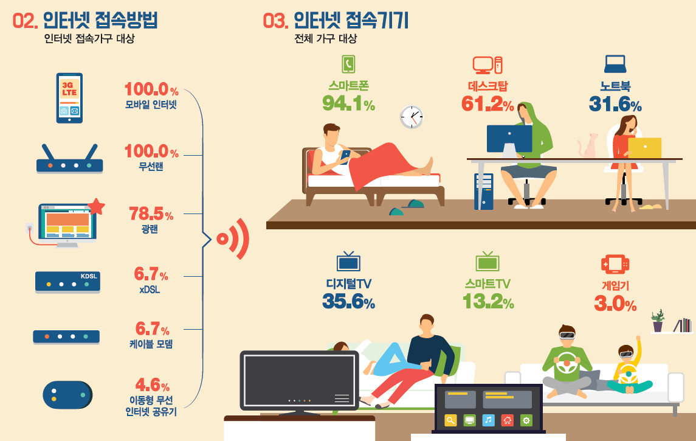
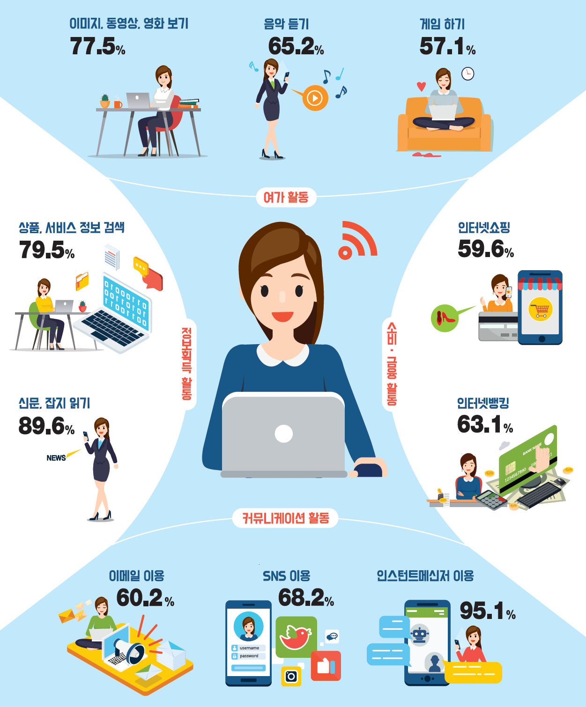

```{r setup, include=FALSE}
knitr::opts_chunk$set(echo = FALSE, message=FALSE, warning=FALSE,
                      comment="", digits = 3, tidy = FALSE, prompt = FALSE, fig.align = 'center')


```

# 인터넷 통계 보고서 [^internet-2016] [^internet-2017] {#internet-report-2016}

[한국인터넷진흥원(KISA)](https://www.kisa.or.kr/main.jsp) 발간하는 인터넷 이용실태 조사 통계를 통해서 대한민국 시민의 SNS를 비롯한 미디어에 대한 정보를 얻을 수 있다.

[^internet-2017]: [KISA (2018-03-28), 2017년 인터넷이용실태조사 통계표 (국문).pdf](https://isis.kisa.or.kr/board/?pageId=060100&bbsId=7&itemId=821&searchKey=&searchTxt=&pageIndex=1)

[^internet-2016]: [KISA (2017-03-18), 2016년 인터넷이용실태조사 통계표 (국문).pdf](https://isis.kisa.or.kr/board/?pageId=060100&bbsId=7&itemId=817&searchKey=&searchTxt=&pageIndex=1)

## 인터넷 접속 {#internet-access}



## 인터넷 접속활동 {#internet-activity}




# 정보통신기기 {#internet-report-table-device}

## 연령별 {#internet-report-table-device-age}

```{r internet-table-data-device}
library(tidyverse)
library(pdftools)
library(extrafont)
loadfonts()

kisa_2017_pdf <- pdf_text("doc/2017년 인터넷이용실태조사 통계표 (국문).pdf")

# <표2> 가구 정보통신기기 보유현황(복수응답) ------

`정보통신기기` <- c("모바일기기", "스마트폰", "디지털TV", "데스크탑컴퓨터", "노트북컴퓨터", "스마트TV")

kisa_2017_device_df <- kisa_2017_pdf[14] %>% 
  tbl_df() %>% 
  mutate(table = str_split(value, "\\r\\n")) %>% 
  unnest(table)

kisa_2017_device_age <- kisa_2017_device_df %>% 
  slice(8:12) %>% 
  select(table) %>% 
  mutate(data = str_remove(str_trim(table), "이하|이상")) %>% 
  mutate(value = map(data, str_split, pattern="\\s+", simplify = TRUE)) 

kisa_2017_device_age_df <- do.call(rbind, kisa_2017_device_age$value) %>% 
  as_tibble() %>% 
  set_names(c("연령", `정보통신기기`)) %>% 
  gather(`정보통신기기`, `이용율`, -`연령`) %>% 
  mutate(`이용율` = parse_number(`이용율`)) %>% 
  mutate(`연령` = factor(`연령`, levels=c("20대", "30대", "40대", "50대", "60세")))
  
kisa_2017_device_age_df %>% 
  spread(`정보통신기기`, `이용율`) %>% 
  DT::datatable()

kisa_2017_device_age_df %>% 
  ggplot(aes(x=`연령`, y=`이용율`, fill=`정보통신기기`)) +
    geom_col(position="dodge") +
    coord_flip() +
    facet_wrap(~`정보통신기기`) +
    theme_bw(base_family="NanumMyeongjo") +
    theme(legend.position = "none") +
    labs(x="", y="정보통신기기 이용율", title="연령대별 정보통신기기 이용율",
         subtitle="상위6개 정보통신기기")
```


## 소득별 {#internet-report-table-device-income}

```{r internet-table-data-income}
kisa_2017_device_income <- kisa_2017_device_df %>% 
  slice(14:19) %>% 
  select(table) %>% 
  mutate(data = str_remove(str_trim(table), "미만|이상")) %>% 
  mutate(value = map(data, str_split, pattern="\\s+", simplify = TRUE)) 

kisa_2017_device_income_df <- do.call(rbind, kisa_2017_device_income$value) %>% 
  as_tibble() %>% 
  set_names(c("가구소득", `정보통신기기`)) %>% 
  gather(`정보통신기기`, `이용율`, -`가구소득`) %>% 
  mutate(`이용율` = parse_number(`이용율`)) %>% 
  mutate(`가구소득` = factor(`가구소득`, levels=c("100만원", "100-200만원", "200-300만원", "300-400만원", "400만원", "무응답")))
  
kisa_2017_device_income_df %>% 
  spread(`정보통신기기`, `이용율`) %>% 
  DT::datatable()

kisa_2017_device_income_df %>% 
  ggplot(aes(x=`가구소득`, y=`이용율`, fill=`정보통신기기`)) +
    geom_col(position="dodge") +
    coord_flip() +
    facet_wrap(~`정보통신기기`) +
    theme_bw(base_family="NanumMyeongjo") +
    theme(legend.position = "none") +
    labs(x="", y="정보통신기기 이용율", title="가구소득별 정보통신기기 이용율",
         subtitle="상위6개 정보통신기기")
```

## 지역별 {#internet-report-table-device-region}

```{r internet-table-data-region, fig.height=8, fig.width=10}
kisa_2017_device_region <- kisa_2017_device_df %>% 
  slice(24:43) %>% 
  select(table) %>% 
  mutate(data = str_extract_all(str_trim(table), "[가-흫].+")) %>% 
  mutate(value = map(data, str_split, pattern="\\s+", simplify = TRUE)) 

kisa_2017_device_region_df <- do.call(rbind, kisa_2017_device_region$value) %>% 
  as_tibble() %>% 
  set_names(c("지역", `정보통신기기`)) %>% 
  filter(!str_detect(`지역`, "\\(|\\)")) %>% 
  gather(`정보통신기기`, `이용율`, -`지역`) %>% 
  mutate(`이용율` = parse_number(`이용율`)) %>% 
  mutate(`정보통신기기` = factor(`정보통신기기`, levels=c("데스크탑컴퓨터", "노트북컴퓨터", "모바일기기", "스마트폰", "디지털TV", "스마트TV")))
  
kisa_2017_device_region_df %>% 
  spread(`정보통신기기`, `이용율`) %>% 
  DT::datatable()

kisa_2017_device_region_df %>% 
  group_by(`정보통신기기`) %>% 
  mutate(`지역` = fct_reorder(`지역`, `이용율`)) %>% 
  ggplot(aes(x=`지역`, y=`이용율`, fill=`지역`)) +
    geom_col(position="dodge") +
    coord_flip() +
    facet_wrap(~`정보통신기기`) +
    theme_bw(base_family="NanumMyeongjo") +
    theme(legend.position = "none") +
    labs(x="", y="정보통신기기 이용율", title="지역별 정보통신기기 이용율",
         subtitle="상위6개 정보통신기기")
```


# 정보통신서비스 {#internet-report-table-service}

## 연령별 {#internet-report-table-service-age}

```{r internet-table-data-service}

# <표8> 가구 정보통신서비스 이용현황(복수응답) -----

`정보통신서비스` <- c("이동전화", "유선인터넷", "케이블TV", "일반집전화", "IPTV", "인터넷전화", "위성방송","스마트홈서비스")

kisa_2017_service_df <- kisa_2017_pdf[21] %>% 
  tbl_df() %>% 
  mutate(table = str_split(value, "\\r\\n")) %>% 
  unnest(table)

kisa_2017_service_age <- kisa_2017_service_df %>% 
  slice(8:12) %>% 
  select(table) %>% 
  mutate(data = str_remove(str_trim(table), "이하|이상")) %>% 
  mutate(value = map(data, str_split, pattern="\\s+", simplify = TRUE)) 

kisa_2017_service_age_df <- do.call(rbind, kisa_2017_service_age$value) %>% 
  as_tibble() %>% 
  set_names(c("연령", `정보통신서비스`)) %>% 
  gather(`정보통신서비스`, `이용율`, -`연령`) %>% 
  mutate(`이용율` = parse_number(`이용율`)) %>% 
  mutate(`연령` = factor(`연령`, levels=c("20대", "30대", "40대", "50대", "60세"))) %>% 
  mutate(`정보통신서비스` = factor(`정보통신서비스`, levels=c("이동전화", "유선인터넷", "케이블TV", "일반집전화", "IPTV", "인터넷전화", "위성방송","스마트홈서비스")))
  
kisa_2017_service_age_df %>% 
  spread(`정보통신서비스`, `이용율`) %>% 
  DT::datatable()

kisa_2017_service_age_df %>% 
  ggplot(aes(x=`연령`, y=`이용율`, fill=`정보통신서비스`)) +
    geom_col(position="dodge") +
    coord_flip() +
    facet_wrap(~`정보통신서비스`) +
    theme_bw(base_family="NanumMyeongjo") +
    theme(legend.position = "none") +
    labs(x="", y="정보통신서비스 이용율", title="연령대별 정보통신서비스 이용율",
         subtitle="상위8개 정보통신기기")
```


## 소득별 {#internet-report-table-service-income}

```{r internet-table-data-service-income}
kisa_2017_service_income <- kisa_2017_service_df %>% 
  slice(14:19) %>% 
  select(table) %>% 
  mutate(data = str_remove(str_trim(table), "미만|이상")) %>% 
  mutate(value = map(data, str_split, pattern="\\s+", simplify = TRUE)) 

kisa_2017_service_income_df <- do.call(rbind, kisa_2017_service_income$value) %>% 
  as_tibble() %>% 
  set_names(c("가구소득", `정보통신서비스`)) %>% 
  gather(`정보통신서비스`, `이용율`, -`가구소득`) %>% 
  mutate(`이용율` = parse_number(`이용율`)) %>% 
  mutate(`가구소득` = factor(`가구소득`, levels=c("100만원", "100-200만원", "200-300만원", "300-400만원", "400만원", "무응답"))) %>% 
  mutate(`정보통신서비스` = factor(`정보통신서비스`, levels=c("이동전화", "유선인터넷", "케이블TV", "일반집전화", "IPTV", "인터넷전화", "위성방송","스마트홈서비스")))

  
kisa_2017_service_income_df %>% 
  spread(`정보통신서비스`, `이용율`) %>% 
  DT::datatable()

kisa_2017_service_income_df %>% 
  ggplot(aes(x=`가구소득`, y=`이용율`, fill=`정보통신서비스`)) +
    geom_col(position="dodge") +
    coord_flip() +
    facet_wrap(~`정보통신서비스`) +
    theme_bw(base_family="NanumMyeongjo") +
    theme(legend.position = "none") +
    labs(x="", y="정보통신서비스 이용율", title="가구소득별 정보통신서비스 이용율",
         subtitle="상위8개 정보통신서비스")
```

## 지역별 {#internet-report-table-service-region}

```{r internet-table-data-service-region, fig.height=8, fig.width=10}
kisa_2017_service_region <- kisa_2017_service_df %>% 
  slice(24:43) %>% 
  select(table) %>% 
  mutate(data = str_extract_all(str_trim(table), "[가-흫].+")) %>% 
  mutate(value = map(data, str_split, pattern="\\s+", simplify = TRUE)) 

kisa_2017_service_region_df <- do.call(rbind, kisa_2017_service_region$value) %>% 
  as_tibble() %>% 
  set_names(c("지역", `정보통신서비스`)) %>% 
  filter(!str_detect(`지역`, "\\(|\\)")) %>% 
  gather(`정보통신서비스`, `이용율`, -`지역`) %>% 
  mutate(`이용율` = parse_number(`이용율`)) %>% 
  mutate(`정보통신서비스` = factor(`정보통신서비스`, levels=c("일반집전화", "유선인터넷", "이동전화", "케이블TV", "IPTV", "인터넷전화", "위성방송","스마트홈서비스")))

kisa_2017_service_region_df %>% 
  spread(`정보통신서비스`, `이용율`) %>% 
  DT::datatable()

kisa_2017_service_region_df %>% 
  filter(!`정보통신서비스` %in% c("위성방송","스마트홈서비스")) %>% 
  group_by(`정보통신서비스`) %>% 
  mutate(`지역` = fct_reorder(`지역`, `이용율`)) %>% 
  ggplot(aes(x=`지역`, y=`이용율`, fill=`지역`)) +
    geom_col(position="dodge") +
    coord_flip() +
    facet_wrap(~`정보통신서비스`) +
    theme_bw(base_family="NanumMyeongjo") +
    theme(legend.position = "none") +
    labs(x="", y="정보통신서비스 이용율", title="지역별 정보통신서비스 이용율",
         subtitle="상위6개 정보통신서비스")
```

# SNS {#internet-report-table-sns}

## 연령별 {#internet-report-table-sns-age}

```{r internet-table-data-sns}

# <표60> 주이용 SNS 서비스(3개 항목 응답)(계속) ----

SNS <- c("페이스북", "카카오스토리", "인스타그램", "네이버밴드", "네이버블로그", "네이버카페", "다음카페", "트위터")

kisa_2017_sns_df <- kisa_2017_pdf[128] %>% 
  tbl_df() %>% 
  mutate(table = str_split(value, "\\r\\n")) %>% 
  unnest(table)

kisa_2017_sns_age <- kisa_2017_sns_df %>% 
  slice(12:18) %>% 
  select(table) %>% 
  mutate(data = str_remove(str_trim(table), "이하|이상")) %>% 
  mutate(value = map(data, str_split, pattern="\\s+", simplify = TRUE)) 

kisa_2017_sns_age_df <- do.call(rbind, kisa_2017_sns_age$value) %>% 
  as_tibble() %>% 
  set_names(c("연령", SNS)) %>% 
  gather(SNS, `이용율`, -`연령`) %>% 
  mutate(`이용율` = parse_number(`이용율`)) %>% 
  mutate(`연령` = factor(`연령`, levels=c("6-19세", "20대", "30대", "40대", "50대", "60대", "70세"))) %>% 
  mutate(SNS = factor(SNS, levels=c("페이스북", "카카오스토리", "인스타그램", "네이버밴드", "네이버블로그", "네이버카페", "다음카페", "트위터")))
  
kisa_2017_sns_age_df %>% 
  spread(SNS, `이용율`) %>% 
  DT::datatable()

kisa_2017_sns_age_df %>% 
  ggplot(aes(x=`연령`, y=`이용율`, fill=SNS)) +
    geom_col(position="dodge") +
    coord_flip() +
    facet_wrap(~SNS, nrow=2) +
    theme_bw(base_family="NanumMyeongjo") +
    theme(legend.position = "none") +
    labs(x="", y="SNS 이용율", title="연령대별 SNS 이용율",
         subtitle="상위8개 SNS 서비스")
```

## 성별 {#internet-report-table-sns-gender}

```{r internet-table-data-sns-gender}

kisa_2017_sns_gender <- kisa_2017_sns_df %>% 
  slice(9:10) %>% 
  select(table) %>% 
  mutate(data = str_remove(str_trim(table), "이하|이상")) %>% 
  mutate(value = map(data, str_split, pattern="\\s+", simplify = TRUE)) 

kisa_2017_sns_gender_df <- do.call(rbind, kisa_2017_sns_gender$value) %>% 
  as_tibble() %>% 
  set_names(c("성별", SNS)) %>% 
  gather(SNS, `이용율`, -`성별`) %>% 
  mutate(`이용율` = parse_number(`이용율`)) %>% 
  mutate(SNS = factor(SNS, levels=c("페이스북", "카카오스토리", "인스타그램", "네이버밴드", "네이버블로그", "네이버카페", "다음카페", "트위터")))
  
kisa_2017_sns_gender_df %>% 
  spread(SNS, `이용율`) %>% 
  DT::datatable()

kisa_2017_sns_gender_df %>% 
  ggplot(aes(x=`성별`, y=`이용율`, fill=SNS)) +
    geom_col(position="dodge") +
    coord_flip() +
    facet_wrap(~SNS, nrow=2) +
    theme_bw(base_family="NanumMyeongjo") +
    theme(legend.position = "none") +
    labs(x="", y="SNS 이용율", title="성별 SNS 이용율",
         subtitle="상위8개 SNS 서비스")
```


## 성별 $\times$ 연령별 {#internet-report-table-sns-gender-age}

```{r internet-table-data-sns-gender-age}
kisa_2017_sns_gender_age <- kisa_2017_sns_df %>% 
  slice(20:33) %>% 
  select(table) %>% 
  mutate(table = str_remove(str_trim(table), "미만|이상")) %>% 
  mutate(data = str_extract_all(str_trim(table), "[가-흫].+")) %>% 
  mutate(value = map(data, str_split, pattern="\\s+", simplify = TRUE)) 

kisa_2017_sns_gender_age_df <- do.call(rbind, kisa_2017_sns_gender_age$value) %>% 
  as_tibble() %>% 
  set_names(c("성별", "연령", SNS)) %>% 
  gather(SNS, `이용율`, -`성별`, -`연령`) %>% 
  mutate(`이용율` = parse_number(`이용율`)) %>% 
  mutate(SNS = factor(SNS, levels=c("페이스북", "카카오스토리", "인스타그램", "네이버밴드", "네이버블로그", "네이버카페", "다음카페", "트위터"))) %>% 
  mutate(`연령` = factor(`연령`, levels=c("6-19세", "20대", "30대", "40대", "50대", "60대", "70세")))

kisa_2017_sns_gender_age_df %>% 
  spread(`연령`, `이용율`) %>% 
  DT::datatable()

kisa_2017_sns_gender_age_df %>% 
  ggplot(aes(x=`연령`, y=`이용율`, fill=`성별`)) +
    geom_col(position="dodge") +
    coord_flip() +
    facet_wrap(~SNS, nrow=2) +
    theme_bw(base_family="NanumMyeongjo") +
    theme(legend.position = "top") +
    labs(x="", y="정보통신서비스 이용율", title="지역별 정보통신서비스 이용율",
         subtitle="상위8개 정보통신서비스")
```

## 직업별 {#internet-report-table-sns-occupation}

```{r internet-table-data-sns-occupation}
kisa_2017_sns_occupation <- kisa_2017_sns_df %>% 
  slice(39:47) %>% 
  select(table) %>% 
  mutate(data = str_remove(str_trim(table), "미만|이상")) %>% 
  mutate(value = map(data, str_split, pattern="\\s+", simplify = TRUE)) 

kisa_2017_sns_occupation_df <- do.call(rbind, kisa_2017_sns_occupation$value) %>% 
  as_tibble() %>% 
  set_names(c("직업", SNS)) %>% 
  filter(!str_detect(`직업`, "\\(|\\)")) %>% 
  gather(SNS, `이용율`, -`직업`) %>% 
  mutate(`이용율` = parse_number(`이용율`)) %>% 
  mutate(SNS = factor(SNS, levels=c("페이스북", "카카오스토리", "인스타그램", "네이버밴드", "네이버블로그", "네이버카페", "다음카페", "트위터")))

  
kisa_2017_sns_occupation_df %>% 
  spread(SNS, `이용율`) %>% 
  DT::datatable()

kisa_2017_sns_occupation_df %>% 
  group_by(SNS) %>% 
  mutate(`직업` = fct_reorder(`직업`, `이용율`)) %>% 
  ggplot(aes(x=`직업`, y=`이용율`, fill=SNS)) +
    geom_col(position="dodge") +
    coord_flip() +
    facet_wrap(~SNS, nrow=2) +
    theme_bw(base_family="NanumMyeongjo") +
    theme(legend.position = "none") +
    labs(x="", y="SNS 이용율", title="직업별 SNS 이용율",
         subtitle="상위8개 SNS 서비스")
```

## 학력별 {#internet-report-table-sns-degree}

```{r internet-table-data-degree}

# <표60> 주이용 SNS 서비스(3개 항목 응답)(계속) ----

kisa_2017_sns2_df <- kisa_2017_pdf[130] %>% 
  tbl_df() %>% 
  mutate(table = str_split(value, "\\r\\n")) %>% 
  unnest(table)

kisa_2017_sns_degree <- kisa_2017_sns2_df %>% 
  slice(7:21) %>% 
  select(table) %>% 
  mutate(data = str_remove(str_trim(table), "이하|이상")) %>% 
  mutate(value = map(data, str_split, pattern="\\s+", simplify = TRUE)) 

kisa_2017_sns_degree_df <- do.call(rbind, kisa_2017_sns_degree$value) %>% 
  as_tibble() %>% 
  set_names(c("학력", SNS)) %>% 
  filter(!str_detect(`학력`, "\\(")) %>% 
  gather(SNS, `이용율`, -`학력`) %>% 
  mutate(`이용율` = parse_number(`이용율`)) %>% 
  mutate(`학력` = factor(`학력`, levels=c("초등졸", "중졸", "고졸", "대졸"))) %>% 
  mutate(SNS = factor(SNS, levels=c("페이스북", "카카오스토리", "인스타그램", "네이버밴드", "네이버블로그", "네이버카페", "다음카페", "트위터")))
  
kisa_2017_sns_degree_df %>% 
  spread(SNS, `이용율`) %>% 
  DT::datatable()

kisa_2017_sns_degree_df %>% 
  ggplot(aes(x=`학력`, y=`이용율`, fill=SNS)) +
    geom_col(position="dodge") +
    coord_flip() +
    facet_wrap(~SNS) +
    theme_bw(base_family="NanumMyeongjo") +
    theme(legend.position = "none") +
    labs(x="", y="SNS 이용율", title="학력별 SNS 이용율",
         subtitle="상위8개 SNS 서비스")
```

## 가구소득별 {#internet-report-table-sns-income}

```{r internet-table-data-sns-income}

kisa_2017_sns_income <- kisa_2017_sns2_df %>% 
  slice(23:27) %>% 
  select(table) %>% 
  mutate(data = str_remove(str_trim(table), "미만|이하|이상")) %>% 
  mutate(value = map(data, str_split, pattern="\\s+", simplify = TRUE)) 

kisa_2017_sns_income_df <- do.call(rbind, kisa_2017_sns_income$value) %>% 
  as_tibble() %>% 
  set_names(c("가구소득", SNS)) %>% 
  gather(SNS, `이용율`, -`가구소득`) %>% 
  mutate(`이용율` = parse_number(`이용율`)) %>% 
  mutate(`가구소득` = factor(`가구소득`, levels=c("100만원", "100-200만원", "200-300만원", "300-400만원", "400만원", "무응답"))) %>% 
  mutate(SNS = factor(SNS, levels=c("페이스북", "카카오스토리", "인스타그램", "네이버밴드", "네이버블로그", "네이버카페", "다음카페", "트위터")))
  
kisa_2017_sns_income_df %>% 
  spread(SNS, `이용율`) %>% 
  DT::datatable()

kisa_2017_sns_income_df %>% 
  ggplot(aes(x=`가구소득`, y=`이용율`, fill=SNS)) +
    geom_col(position="dodge") +
    coord_flip() +
    facet_wrap(~SNS) +
    theme_bw(base_family="NanumMyeongjo") +
    theme(legend.position = "none") +
    labs(x="", y="SNS 이용율", title="가구소득별 SNS 이용율",
         subtitle="상위8개 SNS 서비스")
```

## 지역별 {#internet-report-table-sns-region}

```{r internet-table-data-sns-region, fig.height=8, fig.width=10}

kisa_2017_sns_region <- kisa_2017_sns2_df %>% 
  slice(33:52) %>% 
  select(table) %>% 
  mutate(data = str_extract_all(str_trim(table), "[가-흫].+")) %>% 
  mutate(value = map(data, str_split, pattern="\\s+", simplify = TRUE)) 

kisa_2017_sns_region_df <- do.call(rbind, kisa_2017_sns_region$value) %>% 
  as_tibble() %>% 
  set_names(c("지역", SNS)) %>% 
  filter(!str_detect(`지역`, "\\(|\\)")) %>% 
  gather(SNS, `이용율`, -`지역`) %>% 
  mutate(`이용율` = parse_number(`이용율`)) %>% 
  mutate(SNS = factor(SNS, levels=c("페이스북", "카카오스토리", "인스타그램", "네이버밴드", "네이버블로그", "네이버카페", "다음카페", "트위터")))
  
kisa_2017_sns_region_df %>% 
  spread(SNS, `이용율`) %>% 
  DT::datatable()

kisa_2017_sns_region_df %>% 
  filter(! SNS %in% c("다음카페", "트위터")) %>% 
  group_by(SNS) %>% 
  mutate(`지역` = fct_reorder(`지역`, `이용율`)) %>% 
  ggplot(aes(x=`지역`, y=`이용율`, fill=SNS)) +
    geom_col(position="dodge") +
    coord_flip() +
    facet_wrap(~SNS) +
    theme_bw(base_family="NanumMyeongjo") +
    theme(legend.position = "none") +
    labs(x="", y="SNS 이용율", title="지역별 SNS 이용율",
         subtitle="상위6개 SNS 서비스")
```

# 이용시간 {#internet-report-table-time}

## 연령별 {#internet-report-table-time}

```{r internet-table-data-time}

# <표18> 주평균 인터넷 이용시간(계속) -----

`이용시간` <- c("1시간", "1시간-3시간", "3시간-7시간", "7시간-14시간", "14시간-21시간", "21시간-35시간", "35시간", "주평균")

kisa_2017_time_df <- kisa_2017_pdf[42] %>% 
  tbl_df() %>% 
  mutate(table = str_split(value, "\\r\\n")) %>% 
  unnest(table)

kisa_2017_time_age <- kisa_2017_time_df %>% 
  slice(13:20) %>% 
  select(table) %>% 
  mutate(data = str_remove(str_trim(table), "이하|이상")) %>% 
  mutate(value = map(data, str_split, pattern="\\s+", simplify = TRUE)) 

kisa_2017_time_age_df <- do.call(rbind, kisa_2017_time_age$value) %>% 
  as_tibble() %>% 
  set_names(c("연령", `이용시간`)) %>% 
  gather(`이용시간`, `이용율`, -`연령`) %>% 
  mutate(`이용율` = parse_number(`이용율`)) %>% 
  mutate(`연령` = factor(`연령`, levels=c("3-9세", "10대", "20대", "30대", "40대", "50대", "60대", "70세"))) %>% 
  mutate(`이용시간` = factor(`이용시간`, levels=c("주평균", "1시간", "1시간-3시간", "3시간-7시간", "7시간-14시간", "14시간-21시간", "21시간-35시간", "35시간")))
  
kisa_2017_time_age_df %>% 
  spread(`이용시간`, `이용율`) %>% 
  DT::datatable()

kisa_2017_time_age_df %>% 
  ggplot(aes(x=`연령`, y=`이용율`, fill=`이용시간`)) +
    geom_col(position="dodge") +
    coord_flip() +
    facet_wrap(~`이용시간`, nrow=2) +
    theme_bw(base_family="NanumMyeongjo") +
    theme(legend.position = "none") +
    labs(x="", y="인터넷 이용시간", title="이용시간대별 인터넷 이용시간",
         subtitle="주평균과 시간대별 인터넷 이용시간")
```

## 성별 {#internet-report-table-time-gender}

```{r internet-table-data-time-gender}

kisa_2017_time_gender <- kisa_2017_time_df %>% 
  slice(10:11) %>% 
  select(table) %>% 
  mutate(data = str_remove(str_trim(table), "이하|이상")) %>% 
  mutate(value = map(data, str_split, pattern="\\s+", simplify = TRUE)) 

kisa_2017_time_gender_df <- do.call(rbind, kisa_2017_time_gender$value) %>% 
  as_tibble() %>% 
  set_names(c("성별", `이용시간`)) %>% 
  gather(`이용시간`, `이용율`, -`성별`) %>% 
  mutate(`이용율` = parse_number(`이용율`)) %>% 
  mutate(`이용시간` = factor(`이용시간`, levels=c("주평균", "1시간", "1시간-3시간", "3시간-7시간", "7시간-14시간", "14시간-21시간", "21시간-35시간", "35시간")))
  
kisa_2017_time_gender_df %>% 
  spread(`이용시간`, `이용율`) %>% 
  DT::datatable()

kisa_2017_time_gender_df %>% 
  ggplot(aes(x=`성별`, y=`이용율`, fill=`이용시간`)) +
    geom_col(position="dodge") +
    coord_flip() +
    facet_wrap(~`이용시간`) +
    theme_bw(base_family="NanumMyeongjo") +
    theme(legend.position = "none") +
    labs(x="", y="인터넷 이용시간", title="시간대별 인터넷 이용시간")
```


## 성별 $\times$ 연령별 {#internet-report-table-time-gender-age}

```{r internet-table-data-time-gender-age}
kisa_2017_time_gender_age <- kisa_2017_time_df %>% 
  slice(22:37) %>% 
  select(table) %>% 
  mutate(table = str_remove(str_trim(table), "미만|이상")) %>% 
  mutate(data = str_extract_all(str_trim(table), "[가-흫].+")) %>% 
  mutate(value = map(data, str_split, pattern="\\s+", simplify = TRUE)) 

kisa_2017_time_gender_age_df <- do.call(rbind, kisa_2017_time_gender_age$value) %>% 
  as_tibble() %>% 
  set_names(c("성별", "연령", `이용시간`)) %>% 
  gather(`이용시간`, `이용율`, -`성별`, -`연령`) %>% 
  mutate(`이용율` = parse_number(`이용율`)) %>% 
  mutate(`이용시간` = factor(`이용시간`, levels=c("주평균", "1시간", "1시간-3시간", "3시간-7시간", "7시간-14시간", "14시간-21시간", "21시간-35시간", "35시간"))) %>% 
  mutate(`연령` = factor(`연령`, levels=c("3-9세", "10대", "20대", "30대", "40대", "50대", "60대", "70세")))

kisa_2017_time_gender_age_df %>% 
  spread(`연령`, `이용율`) %>% 
  DT::datatable()

kisa_2017_time_gender_age_df %>% 
  ggplot(aes(x=`연령`, y=`이용율`, fill=`성별`)) +
    geom_col(position="dodge") +
    coord_flip() +
    facet_wrap(~`이용시간`, nrow=2) +
    theme_bw(base_family="NanumMyeongjo") +
    theme(legend.position = "top") +
    labs(x="", y="인터넷 이용시간", title="성별, 시간대별 인터넷 이용시간")
```

## 직업별 {#internet-report-table-time-occupation}

```{r internet-table-data-time-occupation}
kisa_2017_time_occupation <- kisa_2017_time_df %>% 
  slice(43:51) %>% 
  select(table) %>% 
  mutate(data = str_remove(str_trim(table), "미만|이상")) %>% 
  mutate(value = map(data, str_split, pattern="\\s+", simplify = TRUE)) 

kisa_2017_time_occupation_df <- do.call(rbind, kisa_2017_time_occupation$value) %>% 
  as_tibble() %>% 
  set_names(c("직업", `이용시간`)) %>% 
  filter(!str_detect(`직업`, "\\(|\\)")) %>% 
  gather(`이용시간`, `이용율`, -`직업`) %>% 
  mutate(`이용율` = parse_number(`이용율`)) %>% 
  mutate(`이용시간` = factor(`이용시간`, levels=c("주평균", "1시간", "1시간-3시간", "3시간-7시간", "7시간-14시간", "14시간-21시간", "21시간-35시간", "35시간"))) %>% 
  mutate(`직업` = factor(`직업`, levels=c("농림어업직", "생산관련직", "무직/기타", "서비스/판매직", "전문/관리직", "사무직")))

kisa_2017_time_occupation_df %>% 
  spread(`이용시간`, `이용율`) %>% 
  DT::datatable()

kisa_2017_time_occupation_df %>% 
  ggplot(aes(x=`직업`, y=`이용율`, fill=`이용시간`)) +
    geom_col(position="dodge") +
    coord_flip() +
    facet_wrap(~`이용시간`) +
    theme_bw(base_family="NanumMyeongjo") +
    theme(legend.position = "none") +
    labs(x="", y="인터넷 이용시간", title="시간대별 인터넷 이용시간")
```

## 학력별 {#internet-report-table-time-degree}

```{r internet-table-data-time-degree}

# <표60> 주이용 SNS 서비스(3개 항목 응답)(계속) ----

kisa_2017_time2_df <- kisa_2017_pdf[43] %>% 
  tbl_df() %>% 
  mutate(table = str_split(value, "\\r\\n")) %>% 
  unnest(table)

kisa_2017_time_degree <- kisa_2017_time2_df %>% 
  slice(9:23) %>% 
  select(table) %>% 
  mutate(data = str_remove(str_trim(table), "이하|이상")) %>% 
  mutate(value = map(data, str_split, pattern="\\s+", simplify = TRUE)) 

kisa_2017_time_degree_df <- do.call(rbind, kisa_2017_time_degree$value) %>% 
  as_tibble() %>% 
  set_names(c("학력", `이용시간`)) %>% 
  filter(!str_detect(`학력`, "\\(|\\)")) %>% 
  gather(`이용시간`, `이용율`, -`학력`) %>% 
  mutate(`이용율` = parse_number(`이용율`)) %>% 
  mutate(`학력` = factor(`학력`, levels=c("초등졸", "중졸", "고졸", "대졸"))) %>% 
  mutate(`이용시간` = factor(`이용시간`, levels=c("주평균", "1시간", "1시간-3시간", "3시간-7시간", "7시간-14시간", "14시간-21시간", "21시간-35시간", "35시간")))
  
kisa_2017_time_degree_df %>% 
  spread(`이용시간`, `이용율`) %>% 
  DT::datatable()

kisa_2017_time_degree_df %>% 
  ggplot(aes(x=`학력`, y=`이용율`, fill=`이용시간`)) +
    geom_col(position="dodge") +
    coord_flip() +
    facet_wrap(~`이용시간`) +
    theme_bw(base_family="NanumMyeongjo") +
    theme(legend.position = "none") +
    labs(x="", y="인터넷 이용시간", title="학력별 인터넷 주간 이용시간")
```

## 가구소득별 {#internet-report-table-time-income}

```{r internet-table-data-time-income}

kisa_2017_time_income <- kisa_2017_time2_df %>% 
  slice(25:30) %>% 
  select(table) %>% 
  mutate(data = str_remove(str_trim(table), "미만|이하|이상")) %>% 
  mutate(value = map(data, str_split, pattern="\\s+", simplify = TRUE)) 

kisa_2017_time_income_df <- do.call(rbind, kisa_2017_time_income$value) %>% 
  as_tibble() %>% 
  set_names(c("가구소득", `이용시간`)) %>% 
  gather(`이용시간`, `이용율`, -`가구소득`) %>% 
  mutate(`이용율` = parse_number(`이용율`)) %>% 
  mutate(`가구소득` = factor(`가구소득`, levels=c("100만원", "100-200만원", "200-300만원", "300-400만원", "400만원", "무응답"))) %>% 
  mutate(`이용시간` = factor(`이용시간`, levels=c("주평균", "1시간", "1시간-3시간", "3시간-7시간", "7시간-14시간", "14시간-21시간", "21시간-35시간", "35시간")))
  
kisa_2017_time_income_df %>% 
  spread(`이용시간`, `이용율`) %>% 
  DT::datatable()

kisa_2017_time_income_df %>% 
  ggplot(aes(x=`가구소득`, y=`이용율`, fill=`이용시간`)) +
    geom_col(position="dodge") +
    coord_flip() +
    facet_wrap(~`이용시간`) +
    theme_bw(base_family="NanumMyeongjo") +
    theme(legend.position = "none") +
    labs(x="", y="인터넷 이용시간", title="가구소득별 주평균 인터넷 이용시간")
```

## 지역별 {#internet-report-table-time-region}

```{r internet-table-data-time-region, fig.height=8, fig.width=10}

kisa_2017_time_region <- kisa_2017_time2_df %>% 
  slice(35:54) %>% 
  select(table) %>% 
  mutate(data = str_extract_all(str_trim(table), "[가-흫].+")) %>% 
  mutate(value = map(data, str_split, pattern="\\s+", simplify = TRUE)) 

kisa_2017_time_region_df <- do.call(rbind, kisa_2017_time_region$value) %>% 
  as_tibble() %>% 
  set_names(c("지역", `이용시간`)) %>% 
  filter(!str_detect(`지역`, "\\(|\\)")) %>% 
  gather(`이용시간`, `이용율`, -`지역`) %>% 
  mutate(`이용율` = parse_number(`이용율`)) %>% 
  mutate(`이용시간` = factor(`이용시간`, levels=c("주평균", "1시간", "1시간-3시간", "3시간-7시간", "7시간-14시간", "14시간-21시간", "21시간-35시간", "35시간")))
  
kisa_2017_time_region_df %>% 
  spread(`이용시간`, `이용율`) %>% 
  DT::datatable()

kisa_2017_time_region_df %>% 
  group_by(`이용시간`) %>%
  mutate(`지역` = fct_reorder(`지역`, `이용율`)) %>%
  ggplot(aes(x=`지역`, y=`이용율`, fill=`이용시간`)) +
    geom_col(position="dodge") +
    coord_flip() +
    facet_wrap(~`이용시간`, nrow=2) +
    theme_bw(base_family="NanumMyeongjo") +
    theme(legend.position = "none") +
    labs(x="", y="인터넷 이용시간", title="지역별 인터넷 이용시간",
         subtitle="상위6개 SNS 서비스")
```
