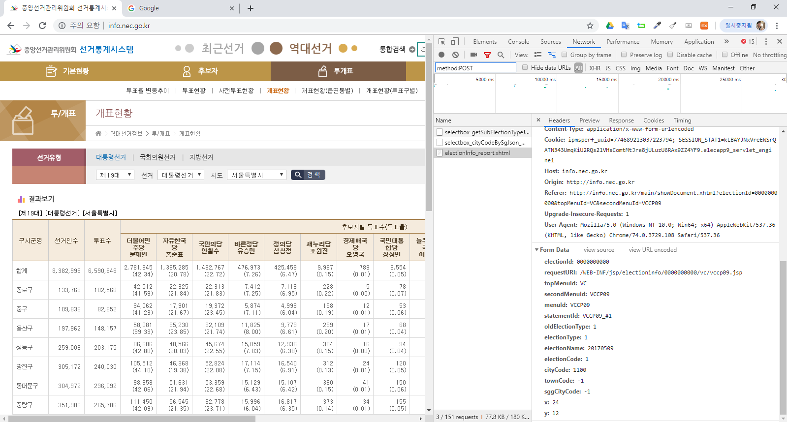

```{r setup, include=FALSE}
knitr::opts_chunk$set(echo = TRUE, message=FALSE, warning=FALSE,
                      comment="", digits = 3, tidy = FALSE, prompt = FALSE, fig.align = 'center')

# 0. 환경설정 -----
library(tidyverse)
library(rvest)
library(httr)

```

# 정치 지형의 변화 {#political-party}

정치 지형의 변화는 대선, 총선, 지선의 3대 선거별로 전체 득표율, 시도별 득표율, 시군구별 득표율, 동 및 투표구별 득표율의 변화를 살펴볼 수 있다.

# 대선

# 총선

# 지선

# 크롤링 사전 {#crawling-dictionary}

```{r crawling-dic}
# 대통령 선거 -----
대선선거회차 <- tribble(
  ~"코드", ~"코드명",
   20170509, "제19대",
   20121219, "제18대",
   20071219, "제17대",
   20021219, "제16대",
   19971218, "제15대",
   19921218, "제14대",
   19871216, "제13대",
   19810225, "제12대",
   19800827, "제11대",
   19791206, "제10대",
   19780706, "제9대",
   19721223, "제8대",
   19710427, "제7대",
   19670503, "제6대",
   19631015, "제5대",
   19600315, "제4대",
   19560515, "제3대",
   19520805, "제2대",
   19480720, "제1대")

# 대통령 선거 연계 시도코드 -----
시도코드 <- tribble(
  ~"코드", ~"코드명",
    1100, "서울특별시",
    2600, "부산광역시",
    2700, "대구광역시",
    2800, "인천광역시",
    2900, "광주광역시",
    3000, "대전광역시",
    3100, "울산광역시",
    5100, "세종특별자치시",
    4100, "경기도",
    4200, "강원도",
    4300, "충청북도",
    4400, "충청남도",
    4500, "전라북도",
    4600, "전라남도",
    4700, "경상북도",
    4800, "경상남도",
    4900, "제주특별자치도")

# 국회의원선거 -----
총선선거회차 <- tribble(
  ~"코드", ~"코드표",
  20160413, "제20대",
  20120411, "제19대",
  20080409, "제18대",
  20040415, "제17대",
  20000413, "제16대",
  19960411, "제15대",
  19920324, "제14대",
  19880426, "제13대",
  19850212, "제12대",
  19810325, "제11대",
  19781212, "제10대",
  19730227, "제9대",
  19710525, "제8대",
  19670608, "제7대",
  19631126, "제6대",
  19600729, "제5대",
  19580502, "제4대",
  19540520, "제3대",
  19500530, "제2대",
  19480510, "제1대")

# 지방의회 선거 -----
지선선거회차 <- tribble(
  ~"코드", ~"코드명",
  20180613,"제7회",
  20140604,"제6회",
  20100602,"제5회",
  20060531,"제4회",
  20020613,"제3회",
  19980604,"제2회",
  19950627,"제1회")

지선선거구분 <- tribble(
  ~"코드", ~"코드명",
   3, "시·도지사선거",
   4, "구·시·군의 장선거",
   5, "시·도의회의원선거",
   6, "구·시·군의회의원선거",
   8, "광역의원비례대표선거",
   9, "기초의원비례대표선거",
   11, "교육감선거",
   10, "교육의원선거"
)
```


# [중앙선관위 선계통계시스템](http://info.nec.go.kr/) {#nec-stat}

[중앙선거관리위원회 선계통계시스템](http://info.nec.go.kr/)의 자료제공방식은 동일한 URL에서 방식이 수차례 변경되었다. 가장 최근 방식에서 데이터를 엑셀 대신에 가져오는 방식은 웹인터페이스를 통해서 `httr` 팩키지 `POST` 방식을 통해 가져오는 것이다. 즉, `POST` 방식을 통해 가져올 데이터 조건을 전달하고 이를 웹에 테이블 형태 표데이터로 나타나게 되면 이를 `rvest` 팩키지를 통해서 데이터를 가져온다.



## 대통령선거 {#nec-stat-presidential}


### 서울특별시 {#nec-stat-presidential-seoul}

가장 먼저 `POST`를 조건을 던져서 데이터를 [중앙선관위 선계통계시스템](http://info.nec.go.kr/)에서 데이터를 가져올 수 있는지 테스트 한다.


```{r nec-stat-presidential-seoul}
# 0. 환경설정 -----
library(tidyverse)
library(rvest)
library(httr)

# 1. 데이터 받아오기 -----
## 1.1 POST() 함수를 사용하여 개표 결과를 수집합니다.
resp <- POST(
    url = 'http://info.nec.go.kr/electioninfo/electionInfo_report.xhtml',
    encode = 'form', 
    body = list(
       electionId = "0000000000",
       requestURI = "/WEB-INF/jsp/electioninfo/0000000000/vc/vccp09.jsp",
       topMenuId = "VC",
       secondMenuId = "VCCP09",
       menuId = "VCCP09",
       statementId = "VCCP09_#1",
       oldElectionType = "1",
       electionType = "1",
       electionName = "20170509",
       electionCode = "1",
       cityCode = "1100",
       townCode = "-1",
       sggCityCode = "-1",
       x = "24",
       y = "12"
    )
  )

Sys.setlocale("LC_ALL", "C")

## Wireshark 데이터 가져오기
table_body <- content(x=resp, as = 'text') %>% 
  read_html() %>% 
  html_node(xpath = '//*[@id="table01"]') %>% 
  html_table(fill=TRUE)

table_header <- content(x=resp, as = 'text') %>% 
  read_html() %>% 
  html_node(xpath = '//*[@id="table01"]') %>% 
  html_text()

Sys.setlocale("LC_ALL", "Korean")

table_list <- str_split(table_header, "\n") %>% unlist
table_list[str_detect(table_list, "민주")]

DT::datatable(table_body)

```


