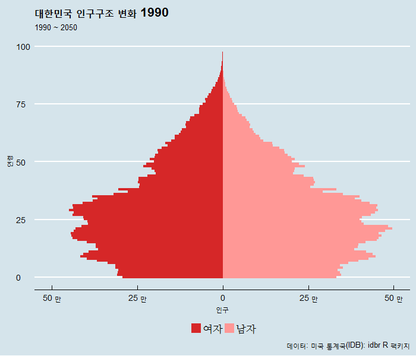

```{r setup, include=FALSE}
knitr::opts_chunk$set(echo = FALSE, message=FALSE, warning=FALSE,
                      comment="", digits = 3, tidy = FALSE, prompt = FALSE, fig.align = 'center')

library(tidyverse)
library(idbr) # devtools::install_github('walkerke/idbr')
library(ggthemes)
library(extrafont)
loadfonts()
```


# 인구 피라미드 [^idbr] {#population-pyramid}

[^idbr]: [idbr: access the US Census Bureau International Data Base in R](http://www.arilamstein.com/blog/2016/06/06/idbr-access-us-census-bureau-international-data-base-r/)

1990년도부터 2050년까지 대한민국 인구구조 변화를 [미국 통계국 데이터베이스(IDB)](http://www.census.gov/population/international/data/idb/informationGateway.php)를 
활용하여 인구 피라미드 구조 변화를 통해 시각적으로 이해한다.

## 국가코드 확인 {#population-pyramid-countrycode}

IDB를 팩키지화하여 데이터 추출작업을 편리하게 만든 것이 `idbr` 팩키지다. 
대한민국을 찾아 뽑아내야 하기 때문에 가장 먼저 국가코드를 확인한다.
`countrycode()` 함수를 활용하여 대한민국 국가코드는 "KS" 임이 확인된다.

``` {r idbr-population-pyramid, message=FALSE}
library(tidyverse)
library(gridExtra)
library(idbr) #install.packages('idbr')
library(countrycode)
library(config)

countrycode('Korea', 'country.name', 'cown')
countrycode('Korea', 'country.name', 'iso3c')
```

## 데이터 가져오기 {#population-pyramid-import-data}

API를 통한 인증방식을 통해 데이터를 열어주고 있기 때문에 
미국 통계국 인증웹페이지 <http://api.census.gov/data/key_signup.html> 에서 전자우편을 통해 API키를 발급받는다.
`idb1()` 함수 국가코드, 기간, 인증키를 설정하면 데이터를 쭉 불러와서 데이터프레임으로 정리한다.
인증키는 등록한 전자우편을 통해서 다음과 같이 전자우편을 통해서 API KEY가 전달된다.

<style>
div.blue { background-color:#e6f0ff; border-radius: 5px; padding: 10px;}
</style>
<div class = "blue">

Census Data API Service <no-reply@census.gov>
오후 1:03 (2시간 전)
나에게

Hello!

Thank you for your interest in the Census Data API. Your API key is 7ae5eXXXXXXXXXXXXXXXXXXXXXX. The key is active and ready to use.

Save this email for future reference.

Have Fun,

The Census Bureau API Team

Follow @uscensusbureau on twitter for API updates.
</div>


<style>
div.blue { background-color:#e6f0ff; border-radius: 5px; padding: 10px;}
</style>
<div class = "blue">

`config` 팩키지를 설치한 후에 `config.yml` 파일에 API KEY를 다음과 같이 정리한다.
그리고 나서 `config::get()` 함수를 호출해서 `config$apikey`를 넘겨 대한민국 인구피라미드 작성에 필요한 데이터를 가져온다.

```{r yaml-apikey, eval=FALSE}
default:
    awskey: "zzzzzXXXXXXXXXXXXXXXXXXXXXX" 
census_data:
    apikey: "7ae5eXXXXXXXXXXXXXXXXXXXXXX" 
```

</div>


``` {r idbr-population-pyramid-data, eval=FALSE}
library(tidyverse)
library(idbr) # devtools::install_github('walkerke/idbr')
library(ggthemes)
library(extrafont)
loadfonts()

(config <- config::get())

idb_api_key(config$apikey)

male <- idb1('KS', 1990:2050, sex = 'male') %>%
  mutate(SEX = 'Male')

female <- idb1('KS', 1990:2050, sex = 'female') %>%
  mutate(POP = POP * -1,
         SEX = 'Female')

korea <- bind_rows(male, female) %>%
  mutate(abs_pop = abs(POP)) %>% 
  mutate(`성별` = ifelse(SEX == "Male", "남자", "여자"))

korea %>% 
  write_csv("data/korea_pop_idb.csv")
```


# 대선연도별 인구구조 변화 {#pyramid-population-president}

## 주요 대선 인구구조 변화 {#pyramid-population-president-trend}

1992년 ~ 2022년 주요 대선 년도별 인구구조 변화를 시각화하면 다음과 같다.
`ggplot` 짝꿍 `gridExtra` 팩키지를 활용하여 `grid.arrange()` 함수를 활용하여 시각화하면 다음과 같다.

``` {r idbr-population-pyramid-election, fig.width=12, fig.height=10}
library(gridExtra)

korea <- read_csv("data/korea_pop_idb.csv")

vis_election <- function(df, title) { 
  g1 <- ggplot(df, aes(x = AGE, y = POP, fill = `성별`, width = 1)) +
    coord_flip() + 
    geom_bar(data = subset(df, `성별` == "남자"), stat = "identity") +
    geom_bar(data = subset(df, `성별` == "여자"), stat = "identity") +
    geom_vline(xintercept = 18, color="darkblue") +
    scale_y_continuous(breaks = seq(-500000, 500000, 250000),
                       labels = c('50 만', '25 만', '0', '25 만', '50 만'), 
                       limits = c(min(korea$POP)-50000, max(korea$POP))) +
    theme_economist(base_size = 10, base_family="NanumMyeongjo") + 
    scale_fill_manual(values = c('#ff9896', '#d62728')) + 
    labs(
      title = paste0(title, " 인구구조"),
      x = "연령",
      y = ""
    ) + guides(fill=FALSE)
}

election_year <- c(1992, 1997, 2007, 2012, 2017, 2022)

for(i in seq_along(election_year)) {
  df <- korea %>% dplyr::filter(time == election_year[i])
  p_name <- paste0("p", election_year[i])
  assign(p_name, vis_election(df, election_year[i]))
}

grid.arrange(p1992, p1997, p2007, p2012, p2017, p2022, nrow=2, ncol=3)
```

## 1990년과 2017년 대선 인구구조 비교 {#pyramid-population-president-1990-2000}

``` {r idbr-population-pyramid-election-2012}
grid.arrange(p1992, p2017, ncol=2)
```

## 2017년과 2022년 대선 인구구조 비교 {#pyramid-population-president-2017-2022}

``` {r idbr-population-pyramid-election-1992}
grid.arrange(p2017, p2022, ncol=2)
```

# 총선연도별 인구구조 변화 {#pyramid-population-congressman}

## 주요 총선 인구구조 변화 {#pyramid-population-congressman-trend}

1992년 ~ 2022년 주요 총선 년도별 인구구조 변화를 시각화하면 다음과 같다.
`ggplot` 짝꿍 `gridExtra` 팩키지를 활용하여 `grid.arrange()` 함수를 활용하여 시각화하면 다음과 같다.

``` {r idbr-population-pyramid-election-congress}
congress_year <- c(2000, 2004, 2008, 2012, 2016, 2020)

for(i in seq_along(congress_year)) {
  df <- korea %>% dplyr::filter(time == congress_year[i])
  p_name <- paste0("p", congress_year[i])
  assign(p_name, vis_election(df, congress_year[i]))
}

grid.arrange(p2000, p2004, p2008, p2012, p2016, p2020, nrow=2, ncol=3)
```

## 2016년과 2020년 대선 인구구조 비교 {#pyramid-population-president-2016-2020}

``` {r idbr-population-pyramid-election-2022}
grid.arrange(p2016, p2020, ncol=2)
```


# 인구 피라미드 애니메이션 {#pyramid-population-president-animation}

1990년부터 2050년까지 각 연도별 `ggplot`을 활용하여 인구 피라미드를 생성하고 나서 이를 `gif` 파일로 변환시키면 
인구 피라미드 애니메이션이 완성된다.

``` {r idbr-population-pyramid-animation, eval=FALSE}
# 이전 gganimate --> 신규 gganimate로 바꾸어야 함!!!
saveGIF({  
  for (i in 1990:2050) {    
    title <- as.character(i)    
    year_data <- dplyr::filter(korea, time == i)
    
    g1 <- ggplot(year_data, aes(x = AGE, y = POP, fill = SEX, width = 1)) +
      coord_fixed() + 
      coord_flip() +
      geom_bar(data = subset(year_data, SEX == "남자"), stat = "identity") +
      geom_bar(data = subset(year_data, SEX == "여자"), stat = "identity") +
      scale_y_continuous(breaks = seq(-500000, 500000, 250000),
                         labels = c('50 만', '25 만', '0', '25 만', '50 만'), 
                         limits = c(min(korea$POP)-50000, max(korea$POP))) +
      theme_economist(base_size = 10) + 
      scale_fill_manual(values = c('#ff9896', '#d62728')) + 
      labs(
        title = paste0("대한민국 인구구조 변화 ", title),
        subtitle = "1990 ~ 2050",
        caption = "데이터: 미국 통계국(IDB): idbr R 팩키지",
        x = "연령",
        y = "인구"
      ) +
      # theme_minimal(base_family="NanumMyeongjo") +
      theme(legend.position = "bottom", legend.title = element_blank(), 
            legend.text=element_text(family="NanumMyeongjo")) + 
      guides(fill = guide_legend(reverse = TRUE))
    print(g1)
  }
}, movie.name = 'korea_pyramid.gif', interval = 0.3, ani.width = 700, ani.height = 600)
```




