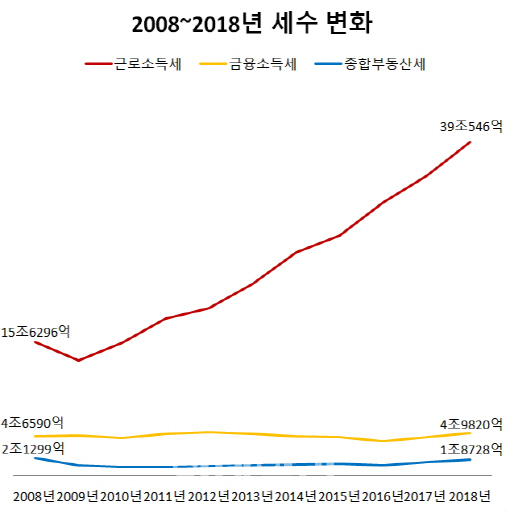

```{r setup, include=FALSE}
knitr::opts_chunk$set(echo = TRUE, message=FALSE, warning=FALSE,
                      comment="", digits = 3, tidy = FALSE, prompt = FALSE, fig.align = 'center')

# 0. 환경설정 -----
library(tidyverse)
library(rvest)
library(httr)

```

# 직장인 지갑만 털었다 [^choi-edaily] [^tax-white-paper] {#salaryman-wallet}

[^choi-edaily]: [최훈길 기자 (2019-12-03), "직장인 지갑만 털었다…근로소득세 10년새 2.5배", 이데일리](https://www.edaily.co.kr/news/read?newsId=01377606622714912&mediaCodeNo=257)

[^tax-white-paper]: [국세청 &rarr; 국세통계 &rarr; 통계자료실](https://stats.nts.go.kr/data/data.asp)



# 국세 수입 [^jose-2018] {#tax-statistics} 

[^jose-2018]: [조세플러스 (2018-07-27), "우리나라, 재산관련 세수 49조-총세수의 12%…OECD 2위"](http://www.joseplus.com/news/newsview.php?ncode=1065573608259799)

- 국세 수입
    - 소득세
    - 법인세
    - 부가가치세
- 2015년 재산관련 세수: 48.6조
    - 재산세 9.3조 
    - 종합부동산세 1.4조 
    - 상속세 1.9조 
    - 증여세 3.1조 
    - 등록면허세 1.8조 
    - 증권거래세 4.7조 
    - 취득세 20.1조 
    - 기타 6.3조

# 세금의 분류 {#tax-taxonomy}

세금은 국가를 집행하는데 꼭 필요한 재원이 된다. 다수 유튜브 강의에서 언급된 내용을 종합하면 다음과 같다.

- 세금
    - 소득
        - 소득세: 개인이 1년간 벌어들인 소득
        - 법인세: 법인이 1년간 벌어들인 소득
    - 소비
        - 부가가치세: 소비의 10% 붙이는 세금
        - 개별소비세: (과)소비의 5~20% 붙이는 세금
    - 재산
        - 취득록세, 상속세(사망), 증여세(생존): 재산을 살때 내는 세금
        - 보유세(재산세, 종합부동산세): 재산을 갖고 있을 때 내는 세금
        - 양도세: 재산을 팔때 내는 세금

<iframe width="300" height="180" src="https://www.youtube.com/embed/nrG-7xnk9mY" frameborder="0" allow="accelerometer; autoplay; encrypted-media; gyroscope; picture-in-picture" allowfullscreen></iframe>

```{r tibble-tax}
library(tidyverse)
library(collapsibleTree)

tax_taxonomy <- tribble(~"대분류", ~"중분류", ~"소분류",
        "세금", "소득", "소득세",
        "세금", "소득", "법인세",
        "세금", "소비", "부가가치세",
        "세금", "소비", "개별소비세",
        "세금", "재산", "취득세", 
        "세금", "재산", "보유세", 
        "세금", "재산", "처분")

tax_taxonomy %>% 
  DT::datatable()
```


```{r tibble-tax-viz}
collapsibleTree(
  tax_taxonomy,
  hierarchy = c("대분류", "중분류", "소분류"),
  width = 800,
  root = "대한민국",
  zoomable = TRUE,
  collapsed = FALSE
)
```


    
    

